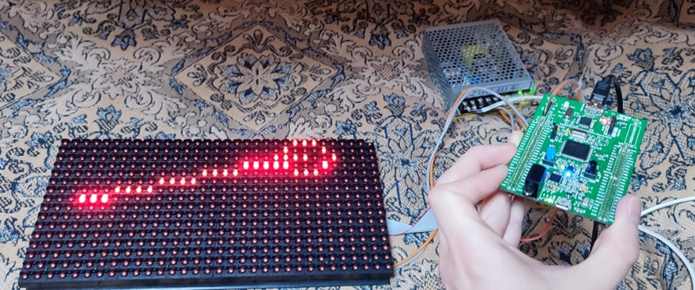

# ЛБ 1 Встраиваемые системы

Тема лабораторной работы:

## Знакомство с SPI. Применение библиотек при разработке ПО под STM32

### Цель работы

При помощи встроенного 3-х осевого акселерометра считать угол наклона отладочной платы STM32F407G-DISC1 и вывести его в виде маятника на светодиодную матрицу P10.


### Введение

Так как нужно использовать встроенный в отладочную плату акселерометр, необходимо изучить то, как произвести инициализацию акселерометра, и то, как получать данные с него в реальном времени.

### Общая информация об 3-х осевом акселерометре LSM303DLHC

LSM303DLHC - это система с цифровым датчиком линейного ускорения 3D и цифровым магнитным датчиком 3D в одном корпусе.
LSM303DLHC имеет полную шкалу линейного ускорения ±2g /±4g / ±8g /±16g и полную шкалу магнитного поля ±1.3 / ±1.9 / ±2.5 / ±4.0 / ±4.7 / ±5,6 / ±8,1 гаусс.

LSM303DLHC оснащен интерфейсом последовательной шины I2C, который поддерживает стандартный и быстрый режимы работы 100 кГц и 400 кГц. Система может быть сконфигурирована для генерации сигналов прерывания по событиям инерционного пробуждения/свободного падения, а также по положению самого устройства. Пороговые значения, время срабатывания, генераторы прерываний, пределы измерений, а соответственно и цена деления программируются конечным пользователем. Магнитный блок и блок акселерометра могут быть включены или переведены в режим отключения питания отдельно.
Именно так и поступим, включим только модуль акселерометра, настроим передачу данных на микроконтроллер при помощи интерфейса I2C.


<p align="center" width="100%">
    
</p>

### Получение информации с акселерометра и её обработка

Для получения информации с акселерометра были создана некоторая библиотека на языке C, состоящая из двух файлов заголовочного (.h) и исходного (.c). Эта библиотека содержит функции и препроцессорные директивы для более удобного использования LSM303DLHC, в том числе выбор измеряемого диапазона ускорений. Чтение и передача данных из микроконтроллера к акселерометру реализована в библиотеке за счет побитовых операций, по интерфейсу I2C

Ниже видны настройки используемого интерфейса
<p align="center" width="100%">
    
</p>

В основном коде программы использование библиотеки сводится к инициализации и проверки связи между микроконтроллером и акселерометром и постоянному опросу датчика в цикле с записью значений ускорений в глобальные переменные x_acc, y_acc, z_acc. После этого начинается обработка данных.

Обработка данных заключается в представлении значений y_acc и z_acc в качестве вектора и нахождение угла между векторной суммой этих ускорений и вертикальным направлением. Угол затем программно фильтруется. После этого, координаты «груза» вычисляются по теореме Пифагора. В качестве гипотенузы используется переменная, содержащая длину «нити маятника».

Ниже приведен программный код вышеупомянутых действий
 
```c
Accel_ReadAcc();
angle = weightCoordinatesCalc();
angleFiltred = expRunningAverage(angle);
weight.x = RopeLength * cos(angleFiltred);
weight.y = RopeLength * sin(angleFiltred) + 7;

```

### Организация вывода на светодиодный модуль P10

Модуль P10 разделён на 4 зоны сканирования по 128 светодиодов в каждой. На рисунке ниже зоны обозначены цветами.

<p align="center" width="100%">
    
</p>

Каждая зона управляется 16 8-битными сдвиговыми регистрами с защелкой. Светодиоды подключены по матричной схеме, катоды светодиодов подключены к выходам сдвиговых регистров, а аноды через транзисторы подключены к линии питания, а также стянуты к земле, чтобы гарантировать нулевой потенциал на них при закрытых транзисторах.

На принципиальной схеме (ниже) видно, что для того, чтобы зажечь светодиод, необходимо, чтобы на выходе регистра (D1-D16), подключенного к катоду этого светодиода был логический ноль, а также должен быть открыт соответствующий нужной зоне MOSFET-транзистор (VT1-VT4).

<p align="center" width="100%">
    
</p>

Таким образом, управлять зоной сканирования модуля можно последовательно загружая данные в сдвиговые регистры (вход R), затем перенося их в регистры хранения путем активации защелки (вход SCLK). Текущая зона выбирается комбинацией логических уровней на входах модуля A и B. Вход OE используется для разрешения работы матрицы, а также управления её яркостью путем подачи ШИМ-сигнала на этот вход.

### Настройка SPI в STM32
Загружать данные в сдвиговые регистры можно с помощью встроенного в STM32 интерфейса SPI. Он использует для обмена данными те же принципы, что и сдвиговые регистры, используемые в модуле P10. Микроконтроллер выдает тактирование (CLK), по фронту которого периферийное устройство проверяет состояние шины данных (MOSI), загружая их в свой сдвиговый регистр.

Настройка SPI в STM32 CubeMX:

<p align="center" width="100%">
    
</p>

Все настройки по умолчанию, изменим только Prescaler - установим максимальный, чтобы компоненты модуля P10 успевали переключаться между логическими уровнями. Если оставить частоту тактирования больше, модуль не функционирует корректно.

CubeMX автоматически определил выходы SPI (SPI1_SCK и SPI1_MOSI). Также определим ножку GPIO для разрешения работы модуля и управления яркостью (nOE).

Для выбора текущей зоны назначим также два пина GPIO, которые будут подключены к входам A и B модуля, дадим им соответствующие имена.

<p align="center" width="100%">
    
</p>


### Использование библиотеки для управления модулем

Использование библиотек позволяет значительно ускорить разработку программного обеспечения. Как правило библиотеки для STM32 состоят из пар заголовочных и исходных файлов языка Си. Заголовочные файлы содержат необходимые препроцессорные директивы, объявления типов данных и прототипы функций, а исходные файлы дополняют эти прототипы программным кодом.

В случае данной лабораторной работы была использована библиотека DMD для модуля P10. Её использование позволяет автоматизировать шаги, которые необходимо выполнить для работы матрицы.
Для отрисовки текста на матрицу перед кодом обновления экрана используются следующие функции:
```c
disp1color_FillScreenbuff(0);
disp1color_DrawPixel((int) anchor.x, (int) anchor.y, 1);
disp1color_DrawPixel((int) weight.x, (int) weight.y, 1);
disp1color_DrawLine((int) anchor.x, (int) anchor.y, (int) weight.x,(int) weight.y);
disp1color_DrawCircle((int) weight.x, (int) weight.y, 2);

disp1color_UpdateFromBuff(); //Перевод рассчитанных данных в массив
prepare_data(); //Разбиение массива на массивы под каждую строку

disp_row(0);
disp_row(1);
disp_row(2);
disp_row(3);

```
Этот код производит следующие действия:

1.Очистить экран от предыдущего кадра

2.Вывести неподвижную точку «подвеса» и точку центра «маятника»

3.Вывести прямую, соединяющую две вышеуказанные точки

4.Вывести окружность с центром в подвижной точке и радиусом 2 пикселя.
 

### Результат работы:
<p align="center" width="100%">
    
</p>
<p align="center" width="100%">
    
</p>


